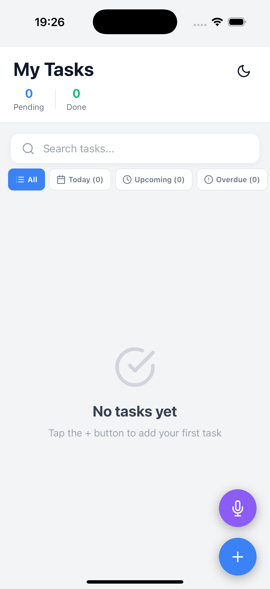
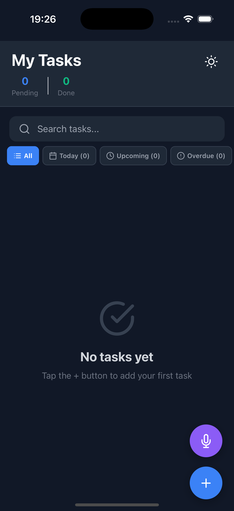
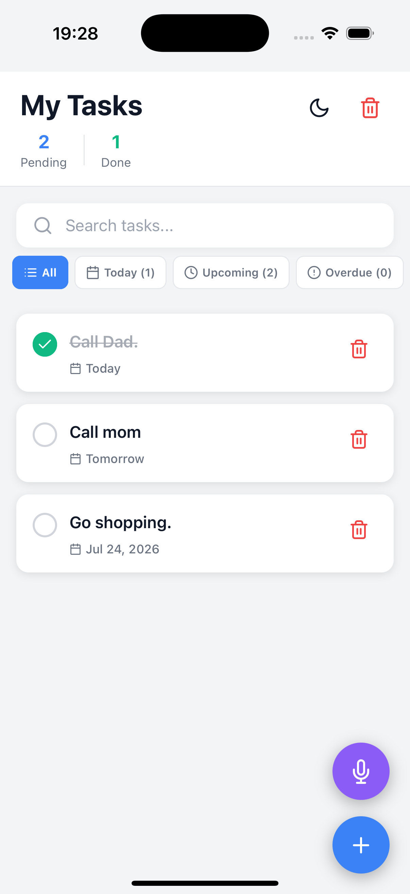
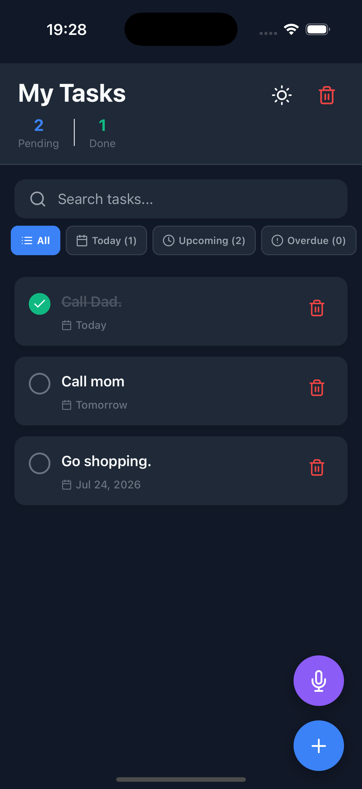
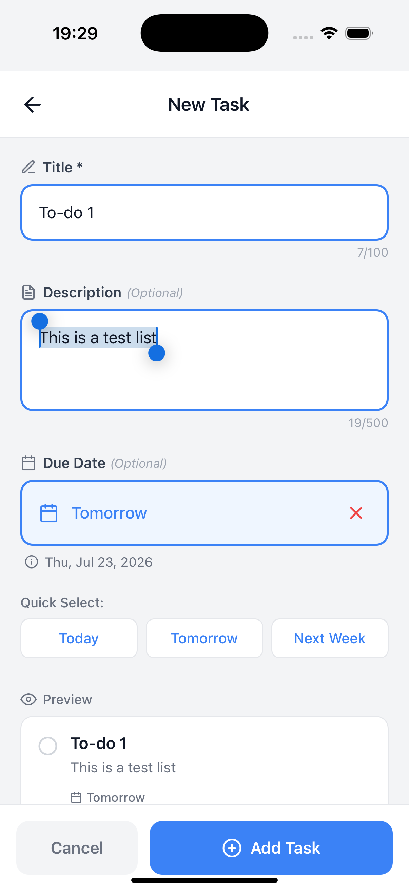
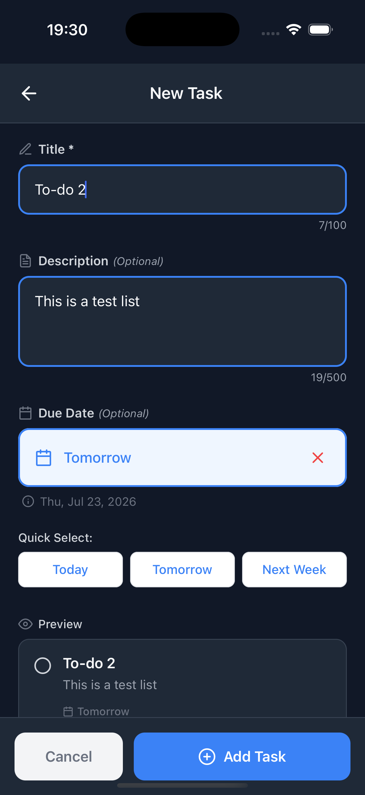
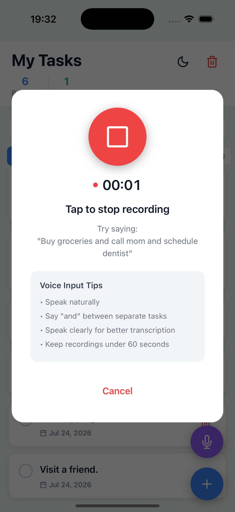
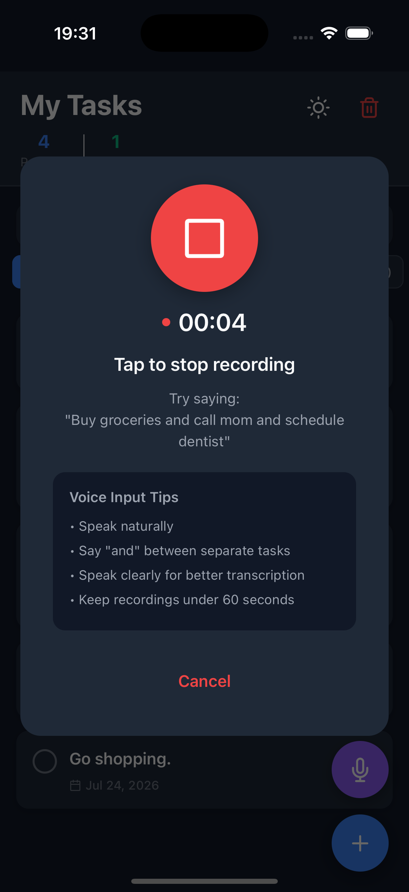
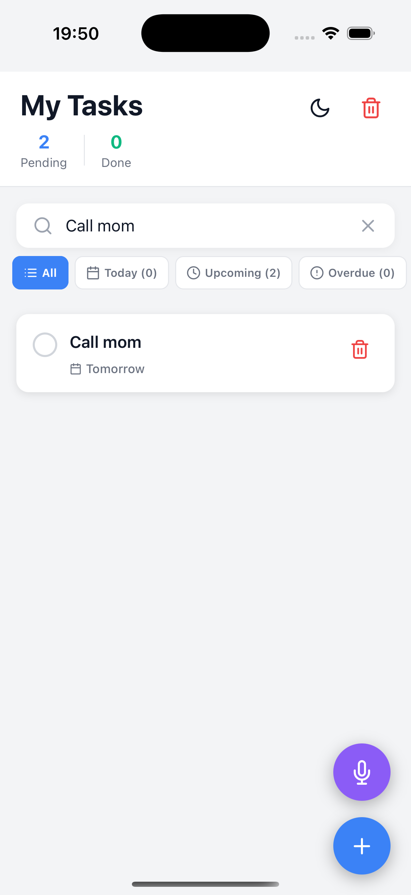
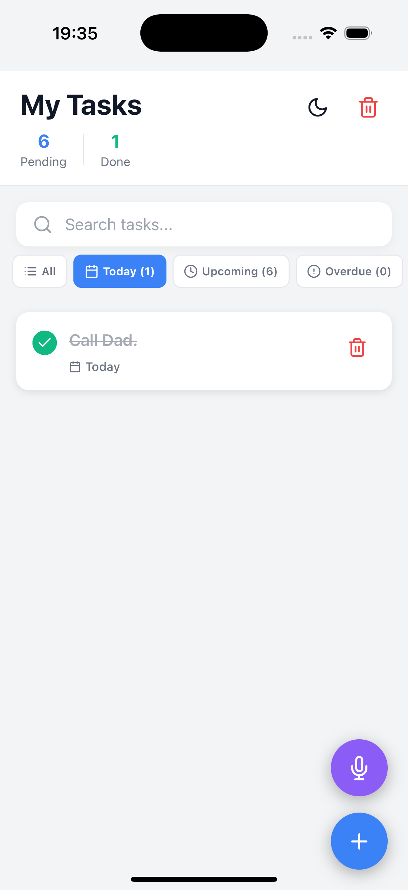

# Todo App — React Native Developer Exercise

A simple and functional Todo application built with React Native and Expo. The app allows users to create, manage, search, filter, and organize tasks, with additional voice input functionality for creating tasks using natural language.

## Features

- Create new tasks
- Edit and manage tasks
- Mark tasks as completed
- Delete individual tasks
- Clear all tasks
- Search tasks by title or description
- Filter tasks by:
  - All
  - Today
  - Upcoming
  - Overdue
  - No Due Date
- Task statistics:
  - Pending tasks
  - Completed tasks
  - Overdue tasks
- Due date support
- Light mode and dark mode
- Voice input for creating tasks
- Natural-language voice task parsing
- Voice commands with date recognition, including:
  - "Call mom tomorrow"
  - "Buy groceries today"
  - "Schedule dentist for Friday"
  - "Call John in 3 days"
  - "Call mom tmr"
- Automatic splitting of multiple voice tasks
- Local task persistence
- Responsive mobile UI

## Screenshots

The screenshots below demonstrate the main application screens and states in both light and dark mode where applicable.

## Tech Stack

- React Native
- Expo
- TypeScript
- React Navigation
- Expo Audio
- Expo Vector Icons
- AsyncStorage / Local Storage
- Groq Whisper API for voice transcription

## Project Structure

.
├── src
│   ├── Components
│   │   ├── FloatingActionButton.tsx
│   │   ├── TaskItem.tsx
│   │   └── VoiceInputModal.tsx
│   │
│   ├── Context
│   │   └── ThemeContext.tsx
│   │
│   ├── Navigation
│   │   └── AppNavigator.tsx
│   │
│   ├── Screens
│   │   ├── AddTaskScreen.tsx
│   │   └── TaskListScreen.tsx
│   │
│   ├── Services
│   │   ├── StorageService.ts
│   │   └── VoiceService.ts
│   │
│   └── Types
│       └── index.ts
│
├── screenshots
│   ├── empty-task-list-light.png
│   ├── empty-task-list-dark.png
│   ├── task-list-with-tasks-light.png
│   ├── task-list-with-tasks-dark.png
│   ├── add-task-light.png
│   ├── add-task-dark.png
│   ├── voice-input-listening-light.png
│   ├── voice-input-listening-dark.png
│   ├── search-and-filters.png
│   └── due-dates.png
│
├── App.tsx
├── app.json
├── package.json
└── README.md

## Getting Started

### Prerequisites

Make sure you have the following installed:

- Node.js
- npm or yarn
- Expo CLI
- iOS Simulator, Android Emulator, or a physical device

For iOS development, macOS with Xcode is required.

### Installation

Clone the repository:

git clone [<YOUR_GITHUB_REPOSITORY_URL>](https://github.com/BremaBoy/to-do-app)

Install dependencies:

npm install

### Environment Variables

The voice transcription feature uses the Groq API.

Create a `.env` file in the root of the project:

EXPO_PUBLIC_GROQ_API_KEY=your_groq_api_key

Do not commit your `.env` file or API key to GitHub.

Make sure `.env` is included in `.gitignore`:

.env
.env.local

### Run the Application

Start the Expo development server:

npx expo start

Then run the application using one of the available options:

npx expo start --ios

or:

npx expo start --android

You can also scan the QR code with the Expo Go application if the project configuration supports your target device.

## Voice Input

The application includes voice-based task creation.

The user can tap the microphone button on the task list screen and speak naturally. The app records the user's voice using Expo Audio and sends the recorded audio to the Groq Whisper API for transcription.

The transcribed text is then processed by the application's voice task parser.

For example:

Call mom tomorrow

becomes:

Task: Call mom
Due Date: Tomorrow

Another example:

Buy groceries today and call John tomorrow

becomes two tasks:

Buy groceries
Due Date: Today

Call John
Due Date: Tomorrow

The parser also supports relative dates and weekdays, such as:

- today
- tomorrow
- tmr
- tmrw
- next week
- Monday
- Tuesday
- Wednesday
- Thursday
- Friday
- Saturday
- Sunday
- in 3 days

The voice feature requires microphone permission and an active internet connection for transcription.

## Task Management

Tasks can be created manually through the Add Task screen or through voice input.

Each task can include:

- Title
- Description
- Due date
- Completion status
- Creation timestamp

Users can mark tasks as completed by interacting with the task item.

Tasks can also be deleted individually or cleared all at once.

## Search and Filtering

The task list includes a search field that allows users to quickly find tasks.

Search matches against:

- Task title
- Task description

The task list can also be filtered using:

- All — Displays all tasks
- Today — Displays tasks due today
- Upcoming — Displays tasks due after today
- Overdue — Displays incomplete tasks whose due dates have passed
- No Due Date — Displays tasks without a due date

Tasks are sorted by due date, with tasks that have upcoming due dates appearing before tasks without due dates.

## Dark Mode

The application supports both light and dark themes.

Users can switch between themes using the theme toggle in the task list header.

The theme is applied across the application's primary screens and components.

## Data Persistence

Tasks are stored locally on the device using the application's storage service.

This allows tasks to remain available when the application is reopened without requiring a backend database for basic task management.

## Code Structure and Approach

The application follows a component-based architecture.

### Components

Reusable UI components such as task items, floating action buttons, and the voice input modal are kept separate from screen-level logic.

### Screens

Screens are responsible for presenting the application's main user flows, including:

- Task list
- Add task

### Services

Application logic that interacts with external APIs or persistent storage is separated into service files.

The main services include:

- `StorageService` — Handles local task persistence
- `VoiceService` — Handles Groq transcription and natural-language voice task parsing

### Context

The theme context manages the application's light and dark mode state.

### Types

TypeScript types are used to provide structure and type safety for tasks and navigation.

## Design Decisions

The application was designed to keep the primary task-management workflow simple and accessible.

The task list is the main screen, allowing users to quickly see their current workload and task statistics.

Search and filters are placed directly above the task list so users can quickly find specific tasks.

The floating action buttons provide two clear ways to create tasks:

- The `+` button for manual task creation
- The microphone button for voice-based task creation

The voice input feature is designed around natural language rather than requiring users to follow a strict command format.

For example, users can say:

Call mom tomorrow

instead of having to manually enter the task and then select a date.

## Error Handling

The application includes error handling for common scenarios, including:

- Microphone permission denial
- Failed voice recording
- Failed audio processing
- Missing Groq API key
- Failed Groq API requests
- Empty or invalid transcriptions
- Failed task persistence

Users are presented with alerts when an operation cannot be completed.

## Future Improvements

Potential improvements include:

- Push notifications for upcoming and overdue tasks
- Recurring tasks
- More advanced natural-language date parsing
- Voice input support for task descriptions
- Backend synchronization
- User accounts and cloud-based task synchronization
- Offline-first voice processing
- Improved accessibility support
- Automated tests for task management and voice parsing